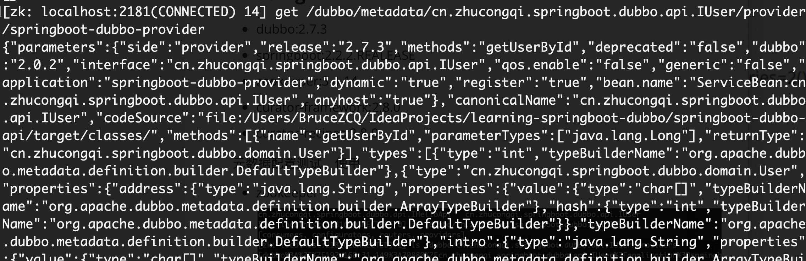
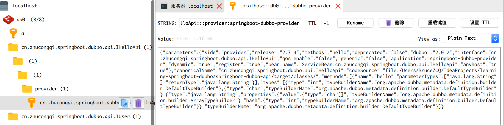

## Learning SpringBoot Dubbo


- http and https support at consumer side

- RestControllerAdvice

  ### using

- dubbo:2.7.3
- springboot:2.2.2.REALEASE
- zookeeper:3.4.14
- curator-framework:2.8.0
- curator-recipes:2.8.0

### 元数据配置测试

#### 在provider中配置

```properties
# 元数据配置-简化基于url驱动的服务网络传输中的无效消耗
#dubbo.metadata-report.address=zookeeper://127.0.0.1:2181
dubbo.registry.simplified=true
dubbo.metadata-report.address=redis://127.0.0.1:6379
```

#### 使用

- zookeeper

  

- redis

  